# 基于 Typst 的某奋进世界一流高校学位论文模板

下面是关于毕设论文模板的说明：

目前还**不能保证已经完全符合**学位论文规范要求，欢迎贡献代码或提出 issue！

- 《人工智能综合实践》的实验报告模板，`./ai-practice/ai-practice-expeirment-report.typ`
- 本科毕业设计模板
  - [`project-assignment.typ`](./project-assignment.typ): 任务书
  - [`project-application.typ`](./project-application.typ): 开题报告
  - [`thesis.typ`](./thesis.typ): 本科毕业论文
  - [`info.typ`](./info.typ): 个人信息

## 使用方法

- Windows 用户
  - clone 本仓库，并下载**这个版本**(Version 0.13.1 (March 7, 2025))的 [Typst](https://github.com/typst/typst/releases/tag/v0.13.1)
  - 将 Typst 添加到环境变量
  - 安装在 `fonts/` 文件夹下的字体（用于数学公式）
  - 开始愉快地写作吧！
- Linux 用户
  - Linux 用户应该不需要本指南（请看下面）
- MacOS 用户
  - 安装 Rust 和 Typst (cargo install typst-cli)
  - 安装在 `fonts/` 文件夹下的字体（用于数学公式）
  - 开始愉快地写作吧！

使用 Typst 编译得到 PDF 文档

```bash
typst c project-application.typ # 开题报告
typst c thesis.typ # 毕业论文
```

## 效果展示

### 任务书

<p align="center"> 
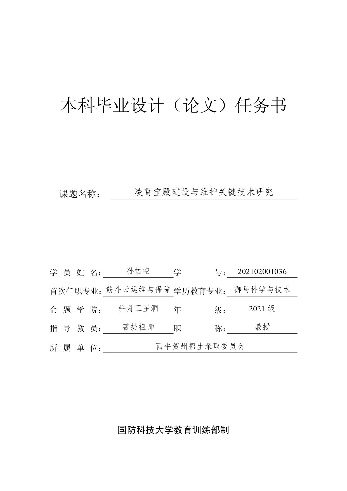 
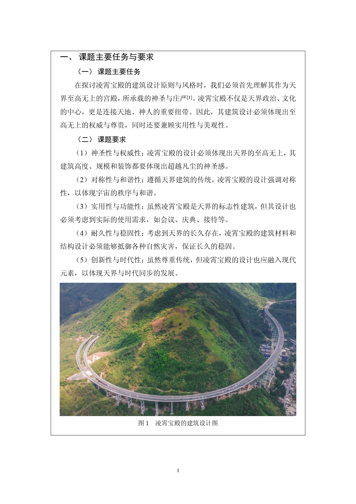 
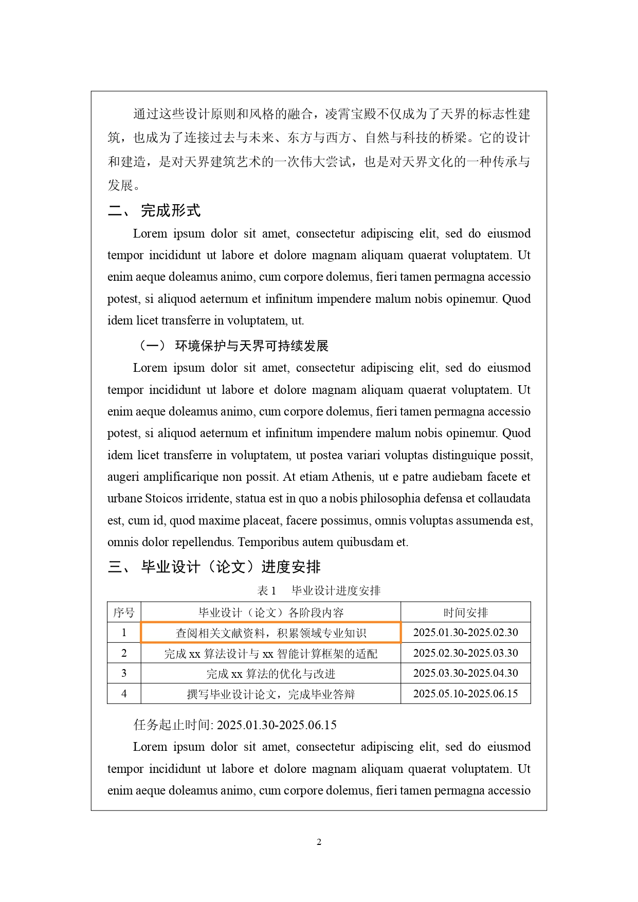 
</p>

<p align="center"> 
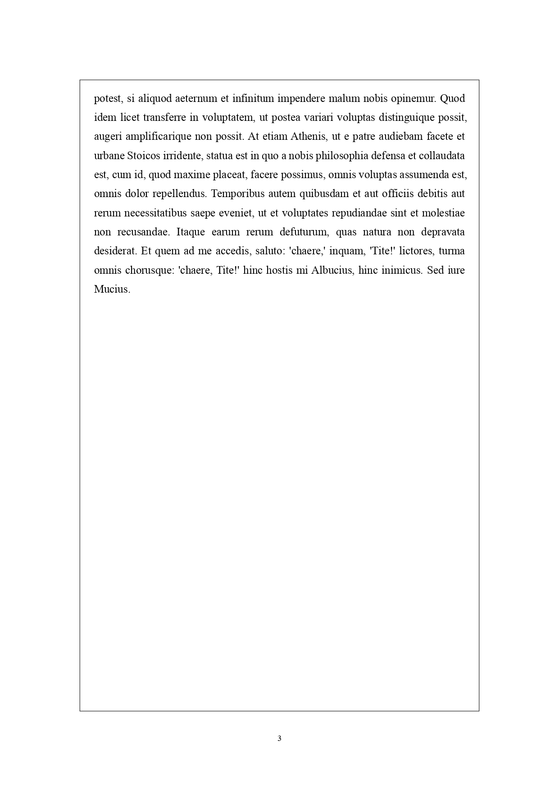 
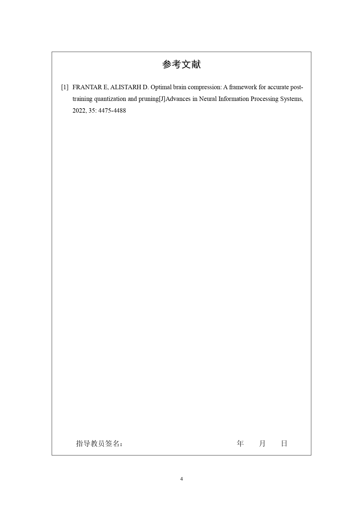 
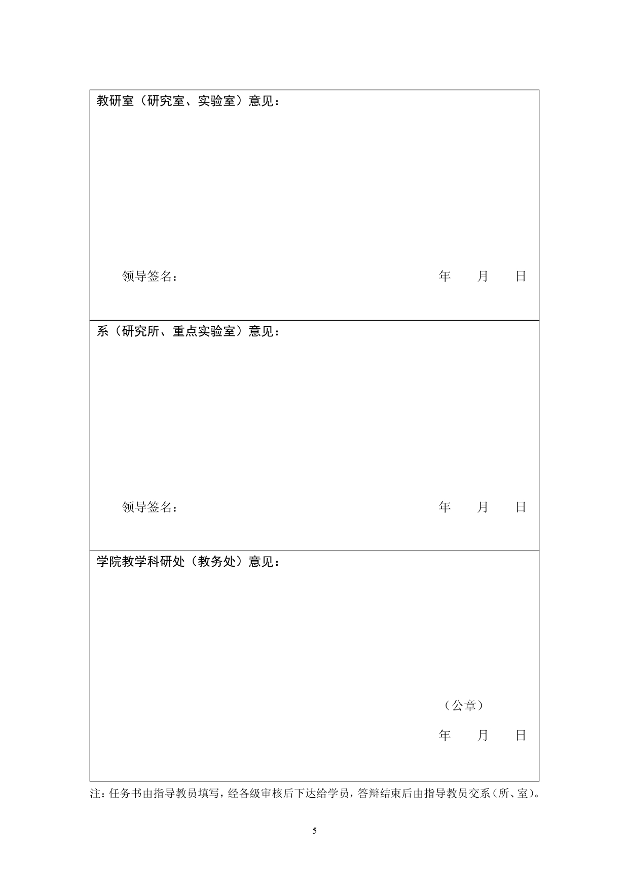 
</p>

### 开题报告

<p align="center"> 
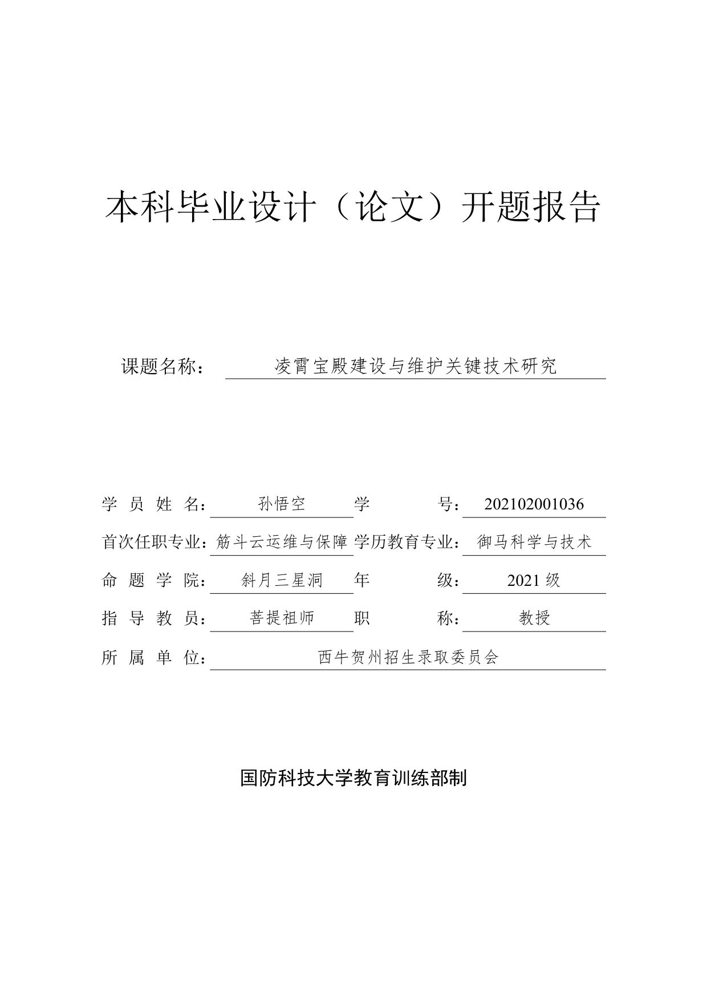 
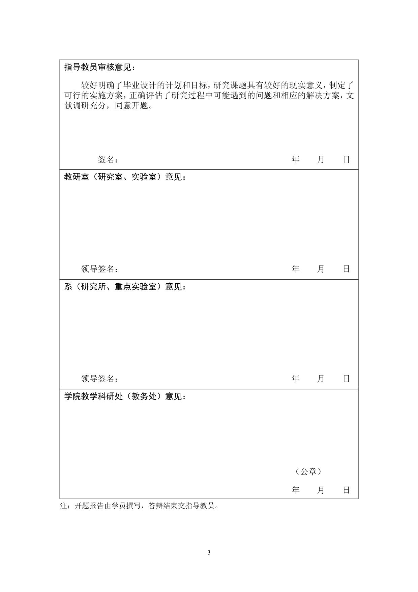 
</p>

### 毕业论文

<p align="center"> 
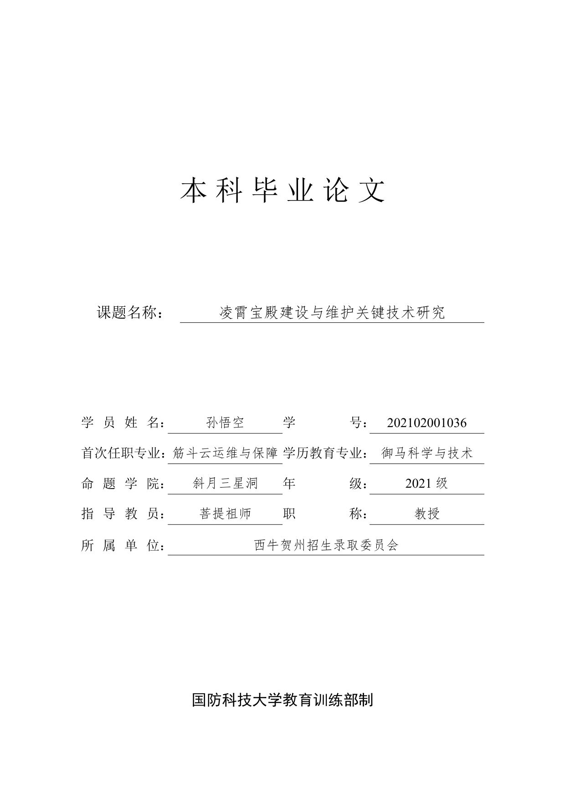 
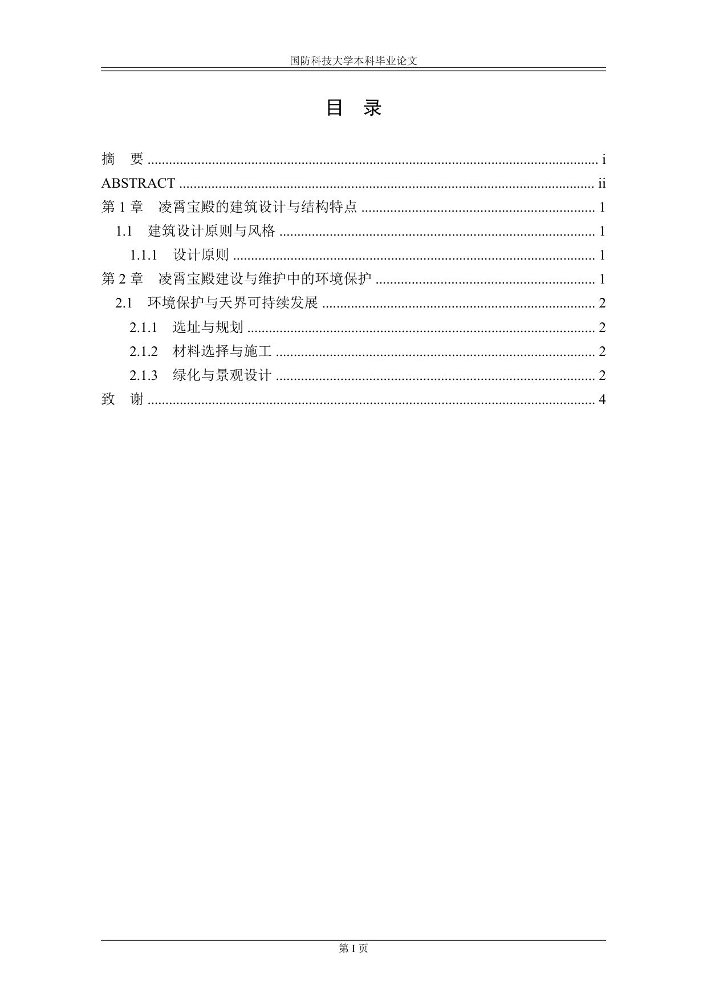 
</p>

<p align="center"> 
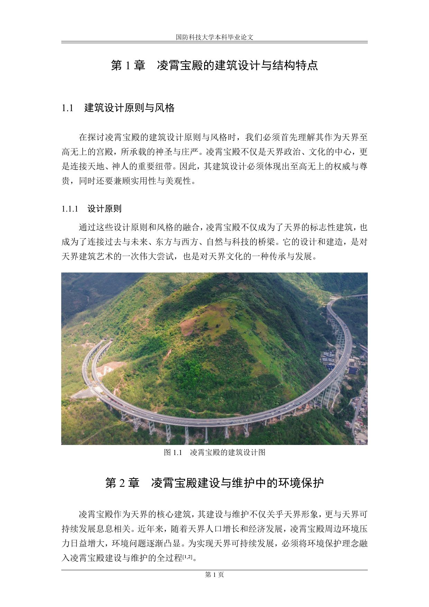 
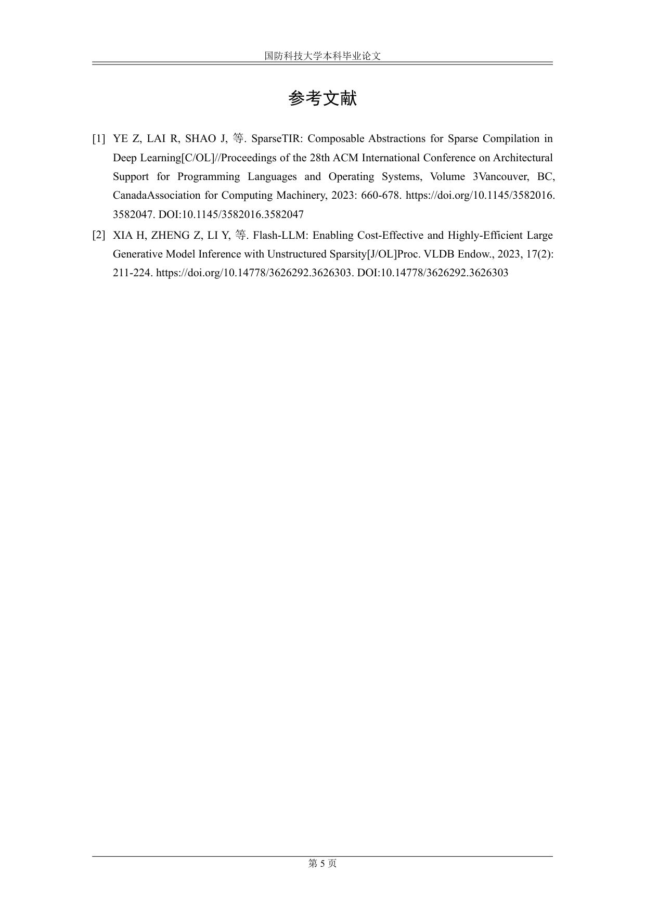 
</p>

### 人工智能综合实践 实验报告

<p align="center"> 
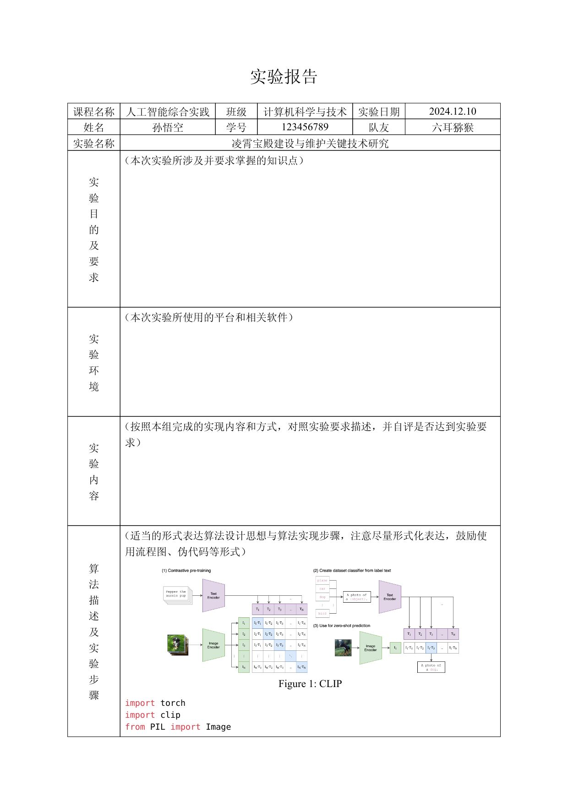 
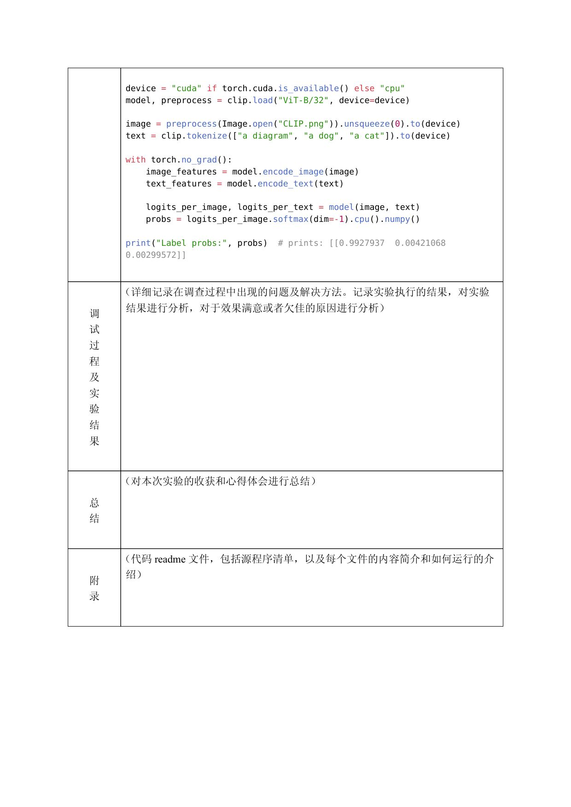 
</p>

## Logs

- 2025.01.09 by [hhw](https://github.com/houhuawei23/)
  - rename and move `ai-practice-expeirment-report.typ` to folder `./ai-practice`;
  - move exported pdfs to folder `exported-pdf`.
- 2025.01.16 by [hhw](https://github.com/houhuawei23/)
  - add template for [project assignment](./project-assignment.typ);
  - update reademe.md, add exported pdf and images.
